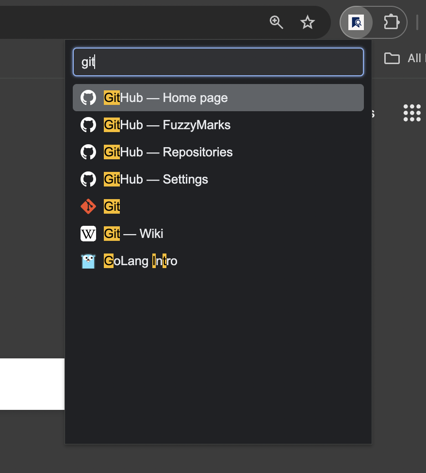

# 🔖 FuzzyMarks — Quickly search and open your bookmarks

Chrome extension that lets you instantly search and open your bookmarks.

<p align="center" >
  
</p>

## 🚀 Features

- 🔍 Lightning-fast fuzzy search on bookmark titles
- 🖱️ Keyboard navigation (↑ / ↓ + Enter)
- 📎 Open bookmarks in the current or a new tab (with Ctrl/⌘)
- 🎨 Matches Chrome's light/dark theme automatically
- ✅ Clean, modern, and minimal UI

## 🛠️ Installation

### Using Chrome WebStore
Coming soon ...

### From source
1. Clone repository:
```shell
git clone https://github.com/inchestnov/fuzzy-marks
```
2. Open browser and go to [chrome://extensions/](chrome://extensions/)
3. Enable developer mode
4. Click «Load unpacked» and select directory

