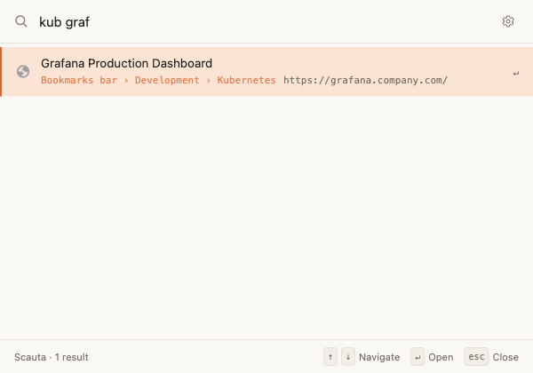
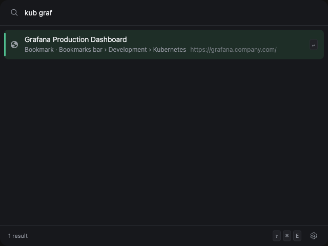
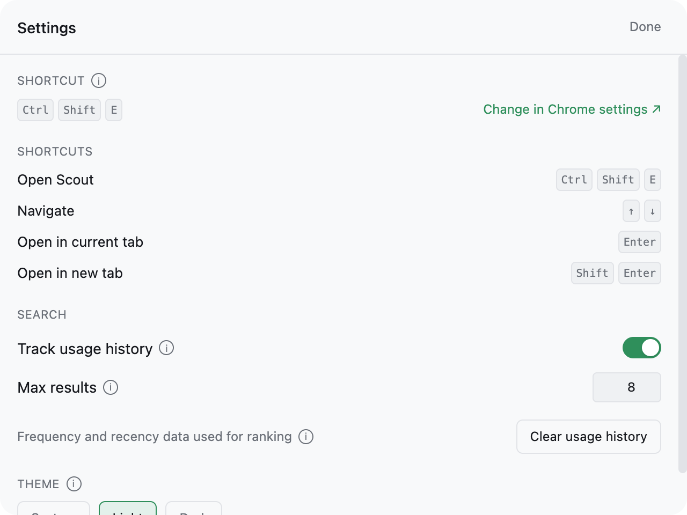

# Scauta

Instant fuzzy search over your browser bookmarks. Press a shortcut, type a few
letters, hit Enter, land on the page. A Raycast/Spotlight-style launcher for
the bookmarks you already have.

## Motivation

Bookmarks scale badly. A few hundred of them, organized into a few folders,
are easy to browse. A few thousand of them, organized into a deep and
inconsistent folder tree built up over years, are not. Chrome's own bookmark
manager is built for organizing, not for finding — it wants you to remember
which folder something lives in.

Scauta drops that requirement. It doesn't replace the browser's bookmark
system and it doesn't keep its own copy of your bookmarks anywhere — the
browser's bookmark tree stays the single source of truth. What Scauta adds is
a fast, typo-tolerant, keyboard-only way to get from "I'm thinking of that
Grafana dashboard" to the tab being open, in as few keystrokes as possible.

## Features

- **Fuzzy search across name, URL, and folder path.** A query like `kub graf`
  matches "Grafana Production Dashboard" filed under `Development / Kubernetes`
  even though neither word appears contiguously in the title — `kub` matches
  the folder path, `graf` matches the name, and both are required.
- **Typo-tolerant.** `grafna` still finds "Grafana Production Dashboard".
- **Tiered ranking**, not a single opaque similarity score: exact name match
  beats a name-prefix match, which beats a URL match, which beats a
  path/folder match, which beats a fuzzy-only match. Nothing from a lower tier
  can outrank a higher one, no matter how it scores on fuzzy similarity or
  usage.
- **Usage-aware.** Bookmarks you open often, or opened recently, are boosted
  within their tier — a frequently used bookmark won't jump ahead of an exact
  name match, but it will jump ahead of an equally-fuzzy competitor.
- **Keyboard-only.** Open with a global shortcut, type, move with `↑`/`↓`,
  open with `Enter`, dismiss with `Esc`. No mouse required at any step.
- **Live index.** The background service worker rebuilds the search index
  whenever bookmarks are added, removed, edited, or moved — no manual refresh.
- **Light and dark themes**, plus a "system" mode that follows the OS.
- **No external storage.** No server, no account, no sync service. The only
  persisted state is local: your settings, usage history, and a cached copy
  of the index, all in `chrome.storage.local`.

## Screenshots

| Light | Dark |
| --- | --- |
|  |  |



Query shown above is `kub graf`, matching "Grafana Production Dashboard"
filed under `Bookmarks bar / Development / Kubernetes` — the exact example
from the product spec.

## Installation

Scauta isn't published to the Chrome Web Store yet. Load it as an unpacked
extension instead.

### Option A: prebuilt (recommended)

A GitHub Action rebuilds the extension on every push to `master` and
publishes the output to the [`dist`](../../tree/dist) branch, so you don't
need Node.js or a build step at all — just the built files:

```bash
git clone -b dist --single-branch git@github.com:inchestnov/scauta.git scauta-dist
```

Then in Chrome:

1. Go to `chrome://extensions`.
2. Enable **Developer mode** (top right).
3. Click **Load unpacked**.
4. Select the `scauta-dist` directory you just cloned.

To pick up updates later, just `git pull` inside `scauta-dist` and click the
reload icon on Scauta's card in `chrome://extensions`.

### Option B: build from source

If you want to modify Scauta or don't trust a prebuilt branch, clone the
default branch and build it yourself:

```bash
git clone git@github.com:inchestnov/scauta.git
cd scauta
npm install
npm run build
```

Then load the resulting `dist/` directory the same way (steps 1-4 above).

Scauta's icon appears in the toolbar either way. Pin it if you want it
visible, though you'll normally never click it — the keyboard shortcut is
the intended entry point.

## Usage

1. Press the shortcut (see [Keyboard shortcuts](#keyboard-shortcuts)).
2. Start typing. Results update as you type — no need to press Enter to
   search.
3. Use `↑`/`↓` to move the selection, or hover with the mouse.
4. Press `Enter` (or click) to open the selected bookmark. If it's already
   open in a tab, Scauta focuses that tab instead of opening a duplicate.
5. Press `Esc` at any point to close the popup without doing anything.

The last query you typed is remembered and restored the next time you open
Scauta, and results are ordered by usage (most/recently opened first) when
the search box is empty.

## Keyboard shortcuts

| Shortcut | Action |
| --- | --- |
| `Ctrl+Shift+E` (Windows/Linux) / `Cmd+Shift+E` (macOS) | Open Scauta |
| `↑` / `↓` | Move selection |
| `Enter` | Open selected bookmark |
| `Esc` | Close the popup, or leave Settings |

The open shortcut is registered as Chrome's `commands._execute_action`, which
opens the extension's popup directly — no background listener is needed to
handle it, and it works even if the service worker is asleep.

Chrome does not let extensions reassign keyboard shortcuts programmatically.
If you want a different combination, or the default conflicts with something
else, open Settings inside Scauta (the gear icon) and use the **"Change in
Chrome settings"** link, which takes you straight to
`chrome://extensions/shortcuts`.

## Configuration

Open Settings from the gear icon in the top-right of the search popup.

- **Shortcut** — read-only display of the currently bound shortcut, with a
  link out to `chrome://extensions/shortcuts` to change it.
- **Track usage history** — toggles whether opening a bookmark affects future
  ranking. Turning it off stops recording new opens; it does not erase what's
  already stored.
- **Max results** — how many results to show at once (3–20).
- **Clear usage history** — wipes all recorded frequency/recency data.
- **Theme** — System, Light, or Dark.

All settings are stored in `chrome.storage.local` and persist across browser
restarts.

## Architecture

Four independent pieces: a background service worker that owns the
authoritative bookmark index, a bookmark collector that flattens the
browser's bookmark tree into flat search documents, a Fuse.js-based search
engine with a tiered ranking layer, and a React popup UI that runs search
entirely client-side against a document set fetched once per popup open.
`chrome.storage.local` is the only persistence layer, used for settings,
usage history, and a cached copy of the index.

See [`docs/architecture.md`](docs/architecture.md) for the full module graph,
the message-passing protocol between the popup and the background worker,
and where a browser-adapter boundary would go for Firefox/Edge/Brave support.

## Development

```bash
npm run dev         # Vite dev server with HMR — load the dist output as an
                     # unpacked extension once, then edits hot-reload
npm run build        # Production build to dist/
npm run typecheck    # tsc --noEmit
npm run test         # Run the vitest suite once
npm run test:watch   # Run vitest in watch mode
```

Project layout:

```
scauta/
├── extension/           # Static icons packaged into the extension
├── src/
│   ├── background/      # MV3 service worker: index lifecycle, message handling
│   ├── bookmarks/       # chrome.bookmarks.getTree() -> BookmarkDocument[]
│   ├── search/          # Fuse.js engine + ranking tiers
│   ├── storage/         # chrome.storage.local wrapper
│   ├── shortcuts/       # Reads the configured command, links to chrome://extensions/shortcuts
│   ├── components/      # React popup UI components
│   ├── popup/           # Popup entry point, client, theme hook, HTML/CSS
│   └── types/           # Shared types and the popup<->background message protocol
├── tests/
│   ├── unit/
│   ├── integration/
│   └── mocks/
├── docs/
├── manifest.config.ts    # MV3 manifest, built with @crxjs/vite-plugin
├── vite.config.ts
└── tailwind.config.js
```

Path alias `@/*` maps to `src/*` (configured in both `tsconfig.json` and
`vite.config.ts`).

## Testing

```bash
npm run test
```

45 tests across 5 files, all passing. Unit tests (`tests/unit/`) cover the
ranking tiers and usage-boost math (`ranking.test.ts`), the bookmark tree
flattening logic (`collector.test.ts`), and the search engine's
tokenization/limit/ordering behavior against the spec's own examples
(`searchEngine.test.ts`). Integration tests (`tests/integration/`) exercise
the bookmark-collection-to-search pipeline end-to-end
(`bookmarks-flow.test.ts`) and the background service worker's index
lifecycle, message handling, and tab focus-or-open logic
(`background.test.ts`), all against the in-memory `chrome.*` API mock in
`tests/mocks/chrome.ts` — no real browser required.

## Roadmap

- **Chrome** — supported today. This is the only browser Scauta currently
  runs on.
- **Firefox, Edge, Brave** — not implemented. The spec calls for an adapter
  layer so other Chromium-based browsers (Edge, Brave) and Firefox's
  WebExtensions API can be supported without touching search, ranking, or UI
  code. The current codebase already isolates every `chrome.*` call to
  `src/background`, `src/bookmarks`, `src/storage`, and `src/shortcuts`,
  which is where that adapter boundary would be introduced — see
  [`docs/architecture.md`](docs/architecture.md#extension-points-for-other-browsers).
- **Chrome Web Store listing** — not published yet; see
  [Installation](#installation) for the unpacked-extension workflow.

## License

[MIT](LICENSE)
